# Techdemo - Serverless Architecture

## Contributors
*   Allyssa Ulz 
*   Monika Popic 
*   Natascha Baumgartner

## Project Description
In this project, we aimed to create a REST API on the AWS platform using JavaScript, AWS Lambda, and API Gateway. The project's objective was to develop a scalable, serverless API that can respond to HTTP queries, deliver data, or take other actions in response to those requests.

We used AWS Lambda, a serverless computing technology that enables code execution without the need to setup or manage servers, to do this. We can use Lambda to construct the business logic for our API in JavaScript and deploy it on AWS. High availability, scalability, and cost-effectiveness are all guaranteed by this method since Lambda automatically handles the supporting infrastructure on our behalf.

### REST API
A REST API (Representational State Transfer Application Programming Interface) is a set of rules and conventions that allows different systems to communicate with each other over the internet. It follows a stateless client-server architecture where the server provides resources, such as data or functionalities, and the client can perform operations on those resources using standard HTTP methods like GET, POST, PUT, and DELETE.

### AWS Lambda
AWS Lambda is a serverless compute service provided by Amazon Web Services (AWS). It allows you to run your code without provisioning or managing servers. With AWS Lambda, you can execute your code in response to various triggers, such as HTTP requests, database events, or file uploads. Lambda provides automatic scaling and high availability, ensuring that your code runs efficiently and reliably.

### API Gateaway
AWS API Gateway is a fully managed service that helps you create, deploy, and manage RESTful APIs at any scale. It acts as a gateway between your clients and the backend services, allowing you to define endpoints, specify request and response transformations, handle authentication and authorization, and set up rate limiting and throttling rules. API Gateway integrates seamlessly with other AWS services, making it a powerful tool for building scalable and secure APIs.

By combining AWS Lambda and API Gateway, we can create a serverless architecture that automatically scales to handle varying levels of traffic and only charges you for the actual usage of your API. This setup eliminates the need to provision and manage infrastructure, allowing you to focus on developing your application logic and providing a seamless experience to your users.

## Step-by-Step implementation

1. Search and open the API Gateway
2. Click on *Erstellen* to go to the setting for creating a new REST API
3. Use following setting and create the API
   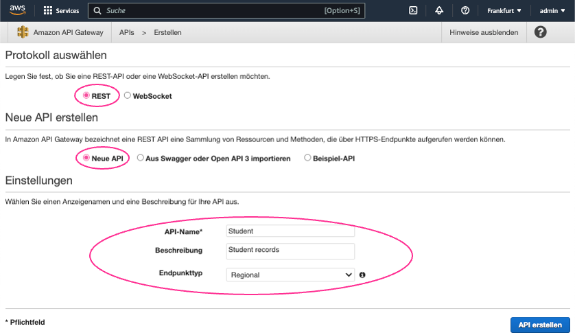
4. Create a new ressource and give it an ressourcename and -path
   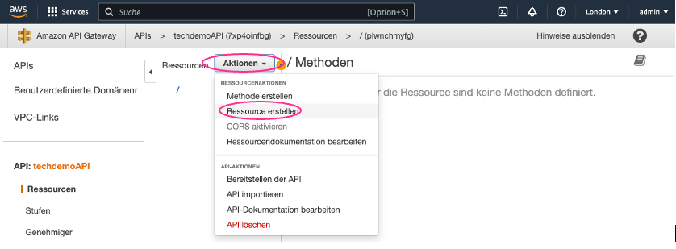
   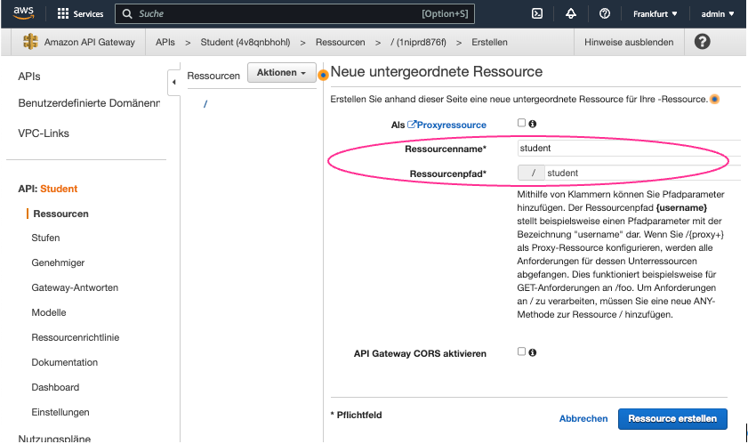
5. Create a GET- and POST-method for the student ressource, choose at first the *Pseudo*-option for both and save it
   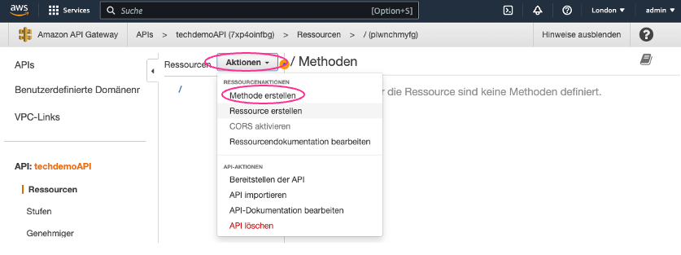
   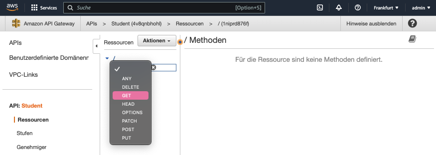
   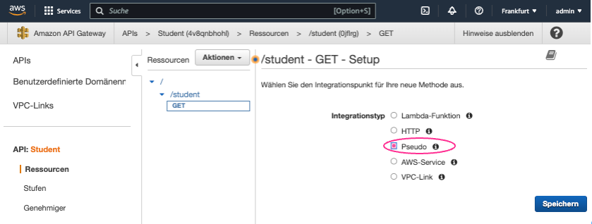
   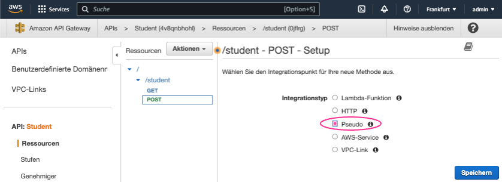
6. Now search and open the AWS Lambda
7. Create a function without any settings and give them a name as example *studentRecords*
    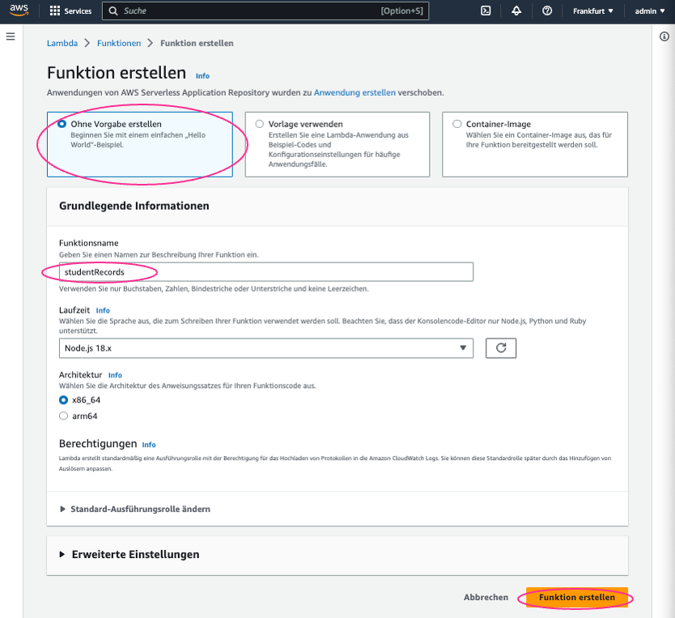
8. Here you can implement you own code as example:
   ```js
    let student = {
        firstName: "Monika",
        lastName:"Popic"
    }

    export const handler = async(event) => {
        console.log(" >>>> Inside lambcda function....");
        if(event.httpMethod === 'GET')
        {
            return getStudentRecord(event);
        }
        if(event.httpMethod === 'POST')
        {
            return createStudentRecord(event);    
        }
    };

    function getStudentRecord (event){
        const response = {
            statusCode: 200,
            body: JSON.stringify({
                student_details: student
        })
    }
        return response;
    }

    function createStudentRecord (event){
        const body = JSON.parse(event.body);
        const response = {
            statusCode: 200,
            body: JSON.stringify({
                message: "successfully created",
                details: body
            })
        }
        return response;
    }
   ```
9.  If you are finish you can at first *Deploy* and then *Test* your code
    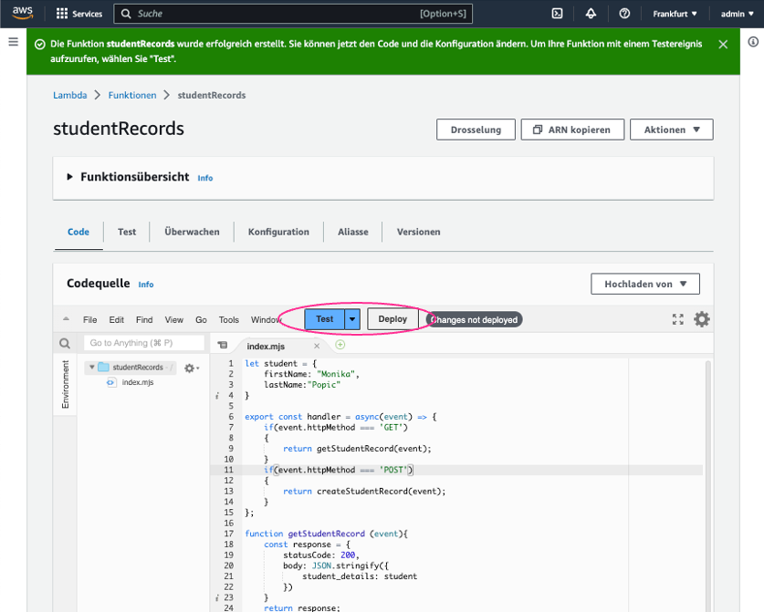
10. Then go back to the API Gateway and choose your API as example *Student*
    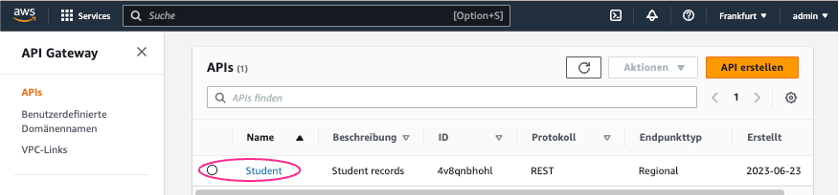
11. Change at your GET- and POST-Method the *Integrationsanforderung* to *Lambda-Funktion* and confirm the checkboxes like in the screenshot and add the Lambda-Funktion we created in the steps before
    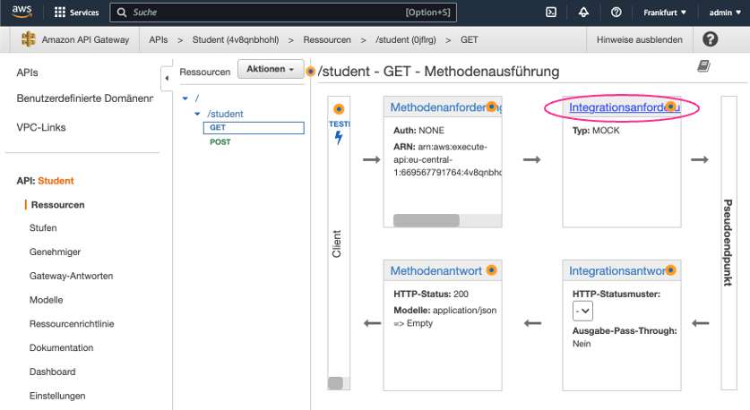
    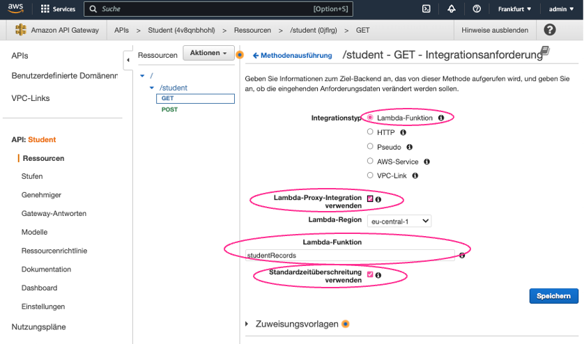
12. If the tests are correct and there are no problems you can deploy the API - for this you have to click on *Aktionen* and *Bereitstellen der API*
    
13. Create a new step *[Neue Stufe]* and choose a stepname *Stufenname*
    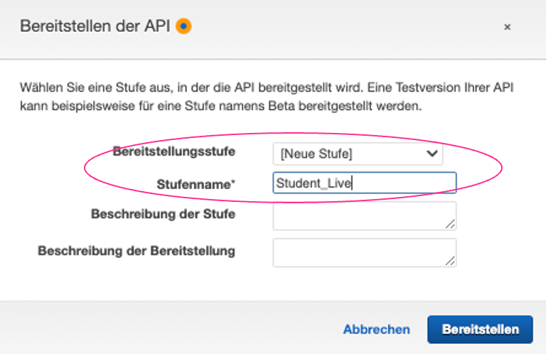
14. Now you receive an URL for GET and POST separatly
    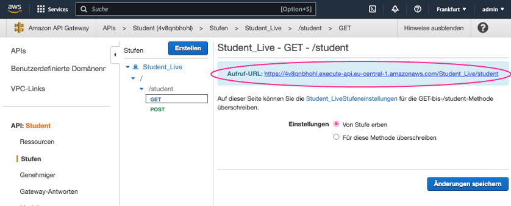
    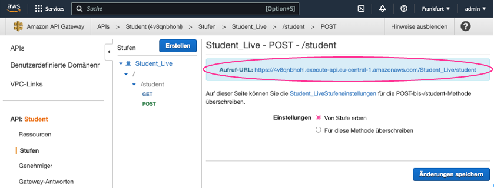
15. To test the GET-method copy the URL in the browser:
    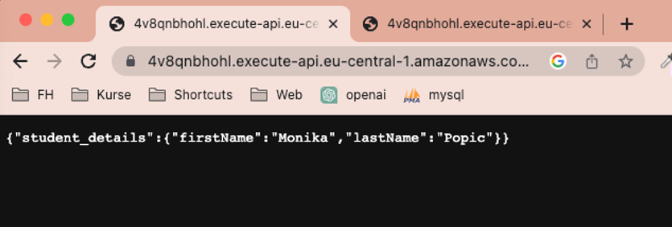
16. To test the POST-method copy the URL in postman and create an request:
    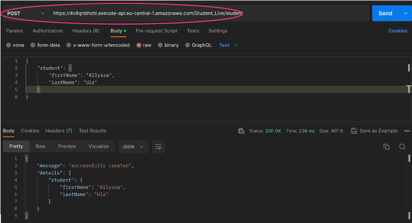

## Conclusion
The tech demo showcased the power and benefits of serverless architecture using AWS Lambda and API Gateway. By leveraging these services, the project successfully created a scalable and cost-effective REST API. The combination of AWS Lambda's serverless compute capabilities and API Gateway's management features allowed for easy development, deployment, and management of the API. The serverless architecture eliminated the need for manual infrastructure provisioning and offered automatic scaling and high availability. Overall, the tech demo demonstrated how serverless architecture can enhance the efficiency and scalability of API development while reducing operational overhead.

## External Ressources
*   <u>[Amazon Web Services (AWS)](https://aws.amazon.com/de/)</u>
*   <u>[Postman](https://www.postman.com/)</u>
